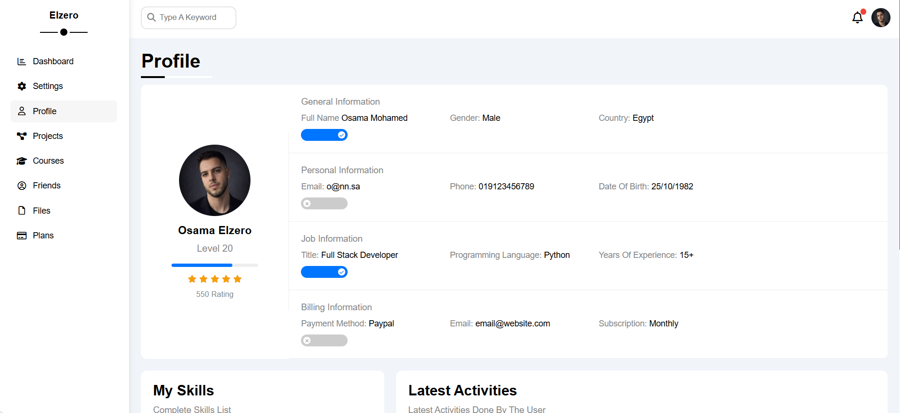

# dashboard-template
A modern responsive admin dashboard built using HTML and CSS. This project is part of Elzero Web School practice templates and includes multiple widgets, tables, and UI components.
# 📊 Dashboard Template

## 📌 Overview
This is a modern and fully responsive admin dashboard built using HTML and CSS.  
It is part of Elzero Web School practice projects aimed at improving front-end development skills and building real UI layouts.

---

## ✨ Features
- Fully responsive dashboard design
- Sidebar navigation menu
- Multiple widgets (Tasks, News, Uploads, Reminders, Stats)
- Projects table with status labels
- Clean and modern UI design
- Organized layout structure

---

## 🛠️ Technologies Used
- HTML5
- CSS3
- Font Awesome
- Google Fonts

---

## 📷 Preview

---

## 🚀 Live Demo
(https://mahmoudkourd2004-prog.github.io/dashboard-template/)

---

## 📁 How to Use
1. Clone the repository  
2. Open `index.html` in your browser  
3. Explore the dashboard interface  

---

## 🎯 Purpose
This project was built for learning purposes as part of Elzero Web School to practice real-world dashboard layouts and responsive UI design.

---

## 👨‍💻 Author
Mahmoud Elkourd
